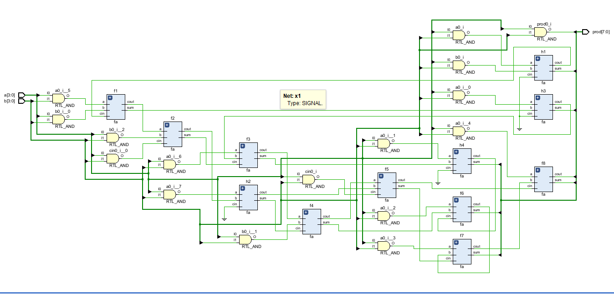
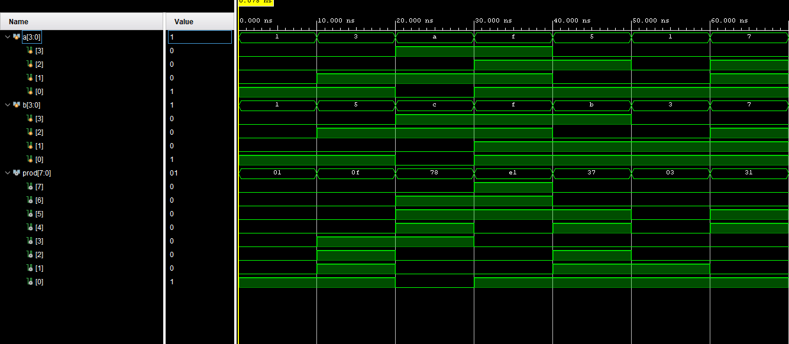

# 4-bit Multiplier using Verilog

## 📌 Description
This project implements a 4-bit binary multiplier using structural Verilog. Partial products are generated using AND operations and summed using full adders to produce an 8-bit output.

## 🧠 Design Overview
- Inputs: 4-bit `a`, 4-bit `b`
- Output: 8-bit `prod`
- Method: Partial product generation + full adder stages
- Modeling: Structural (using `fa` modules)

## 📁 Folder Structure
- `rtl/` → Verilog design code  
- `testbench/` → Testbench for simulation  
- `netlist/` → Synthesized netlist  
- `docs/` → Images and documentation  

## 🛠️ Tools Used
- Xilinx Vivado  
- Verilog HDL  

## 📊 Results

### 🔹 Schematic

### 🔹 Simulation Waveform

## ▶️ How to Run
1. Open project in Vivado  
2. Add RTL and testbench files  
3. Run simulation  
4. Run synthesis to generate netlist  

## 👨‍💻 Author
GWTA UMAKANTH
